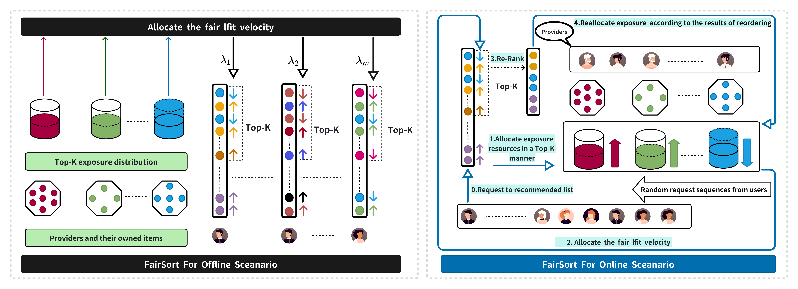
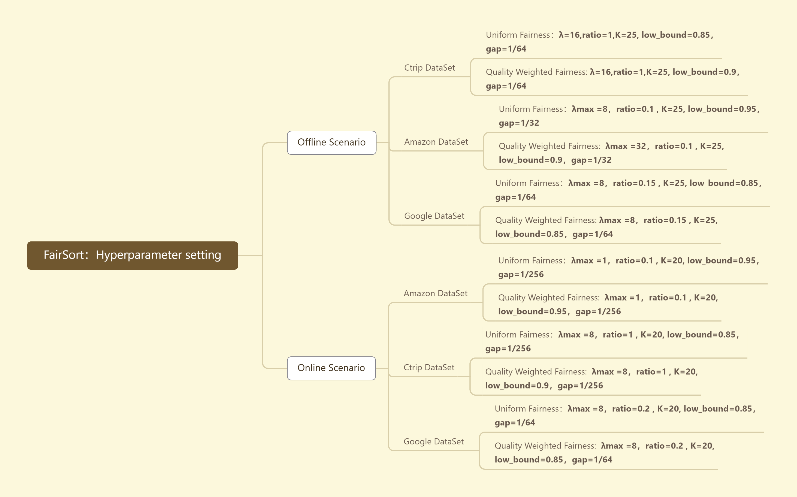

#FairSort Diagram

A  implementation of "FairSort: Learning to Fair Rank for Personalized
Recommendations in Two-Sided Platforms"

<div align=center></div>


# Hyperparameter setting




[//]: # (![img_2.png]&#40;img_2.png&#41;)

[//]: # (![img_1.png]&#40;img_1.png&#41;)

## Run the code
After installation, you can clone this repository
```
git clone https://github.com/13543024276/FairSort
cd FairSort/FairSort_OffLine or cd FairSort/FairSort_OffLine
[such as Amazon]
python FairSort_Online_Amazon.py 
        
```


## DataSet

1-Ctrip Flight Dataset. The entire dataset contains data
from 3,814 customers, 6,006 kinds of air tickets, and 25,190
orders. It also provides basic information on customers, air
ticket class, air ticket price, flight time, airline company of
the ticket, and other information. we adopt the state-of-the-
art collaborative filtering air ticket recommendation algorithm
to process the data and obtain a preference matrix.

2-Amazon Review Dataset. We used data from, which
has the largest data due to its large number of reviews. We
pre-filtered items and users with less than 10 reviews or being
reviewed and only consider reviews of items in the “Clothing
Shoes and Jewelry” category, which has the largest number
of reviews. And using the well-known matrix decomposition
model [42] to estimate users’ preference scores for items,
the dataset does not provide information between items and
providers. We then model the providers by clustering methods,
with 1-100 items clustered into one category. The processed
dataset contains 1,851 users, 7,538 items, 161 providers.

3-Google Local DataSet. This dataset is unique, where each
item represents an individual provider. This was released in
and contains reviews about local businesses from Google
Maps. It also filtered items and users who participated in
reviews less than 10 times, then obtained a dataset containing
3,335 users, 4,927 items (providers), and 97,658 reviews. The
data is processed by using an implicit decomposition algorithm
based on location information.
